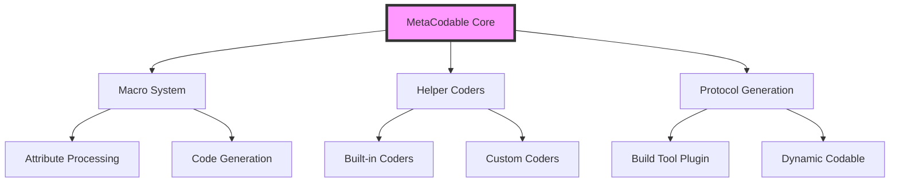
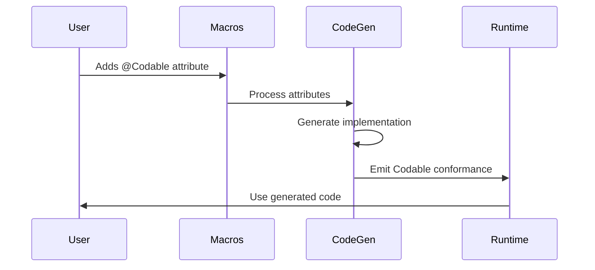

# MetaCodable Architecture

This document provides a high-level overview of MetaCodable's architecture and implementation details.

## Overview

MetaCodable is a Swift macro-based framework that supercharges Swift's `Codable` implementations. It uses the power of Swift macros to generate sophisticated coding logic while keeping the API simple and declarative.

## Core Components

### 1. Macro System
The core of MetaCodable is built around Swift's macro system, primarily using:
- `@Codable` - The main attribute macro that drives the code generation
- `@CodedAt`, `@CodedIn`, `@CodedBy` etc. - Attribute macros for customizing coding behavior
- `PluginCore` - Core functionality for macro expansions and code generation

### 2. Helper Coders System
Implements extensible coding strategies through:
- `HelperCoder` protocol for custom coding implementations
- Built-in coders like `ValueCoder`, `SequenceCoder`, etc.
- Support for custom coders through `@CodedBy` attribute

### 3. Protocol Generation System
Provides dynamic protocol conformance through:
- `MetaProtocolCodable` build tool plugin
- `DynamicCodable` type for generating protocol implementations
- Source code parsing and synthesis capabilities

## Data Flow

## Key Features

1. **Flexible Key Mapping**
   - Custom CodingKey values per property
   - Nested coding key support
   - Multiple coding key paths

2. **Smart Defaults and Error Handling**
   - Default value specification
   - Custom error handling
   - Missing value handling

3. **Protocol and Type Support**
   - Enum support with various tagging styles
   - Protocol type generation
   - Generic type support

## Implementation Details

### Attribute Processing
The framework processes attributes in multiple phases:
1. Attribute validation and preprocessing
2. Context gathering and analysis
3. Code generation and emission

### Code Generation
The code generation system follows these principles:
1. Maintains source compatibility
2. Generates optimal, efficient code
3. Supports full customization through attributes
