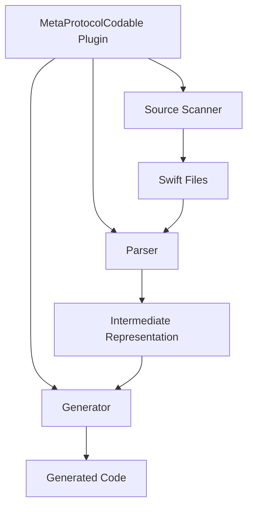

# Build Tool Plugin System

This document explains the implementation details of MetaCodable's build tool plugin system.

## Overview

The build tool plugin system is primarily implemented through the `MetaProtocolCodable` plugin which generates protocol implementations at build time.

## Architecture



## Components

### 1. Plugin Core

The plugin system is built on Swift Package Manager's plugin architecture and consists of:

```swift
@main
struct MetaProtocolCodable: BuildToolPlugin {
    func createBuildCommands(
        context: PluginContext,
        target: Target
    ) throws -> [Command]
}
```

Key responsibilities:
- Configuration management
- Build command generation
- File management

### 2. Source Scanner

The source scanner:
- Identifies relevant Swift files
- Extracts protocol information
- Handles dependencies

### 3. Parser

The parser component:
- Processes Swift syntax
- Extracts type information
- Generates intermediate representations

### 4. Generator

The code generator:
- Synthesizes implementations
- Handles type safety
- Manages symbol resolution

## Implementation Details

### Configuration

The plugin uses a configuration system that can be customized through:
- JSON files
- Property lists
- Command-line arguments

Example configuration:
```json
{
    "scanDependencies": true,
    "outputFormat": "swift",
    "generatedFilePrefix": "Generated",
    "modules": ["CoreModule", "UtilityModule"]
}
```

### Build Process

1. **Initialization**
   - Load configuration
   - Set up build environment
   - Prepare output directories

2. **Scanning**
   - Identify source files
   - Extract protocol definitions
   - Build dependency graph

3. **Generation**
   - Create intermediate files
   - Generate implementations
   - Output final code

### File Structure

The plugin generates files in a structured manner:

```
PluginOutput/
├── Intermediate/
│   ├── Module1.json
│   └── Module2.json
├── Generated/
│   ├── Protocol1.swift
│   └── Protocol2.swift
└── BuildArtifacts/
    └── metadata.json
```

## Usage in Development

### 1. Plugin Integration

Add to your `Package.swift`:
```swift
.plugin(
    name: "MetaProtocolCodable",
    capability: .buildTool(),
    dependencies: ["ProtocolGen"]
)
```

### 2. Protocol Definition

Mark protocols for generation:
```swift
@DynamicCodable
protocol CustomProtocol {
    var id: String { get }
    var data: Data { get }
}
```

### 3. Build Process

The plugin automatically:
1. Scans for marked protocols
2. Generates implementations
3. Includes generated code in build

## Extending the Plugin

### Custom Generators

Create custom generators by:
1. Implementing the generator protocol
2. Registering with the plugin
3. Handling custom types

Example:
```swift
struct CustomGenerator: CodeGenerator {
    func generate(for type: TypeDefinition) throws -> String {
        // Custom generation logic
    }
}
```

### Build Process Hooks

The plugin provides hooks for:
- Pre-build processing
- Post-generation validation
- Error handling

## Best Practices

1. **Performance**
   - Use incremental generation
   - Cache intermediate results
   - Optimize file I/O

2. **Maintainability**
   - Document generated code
   - Version control integration
   - Clear error messages

3. **Integration**
   - Clean build support
   - IDE integration
   - Debug support
