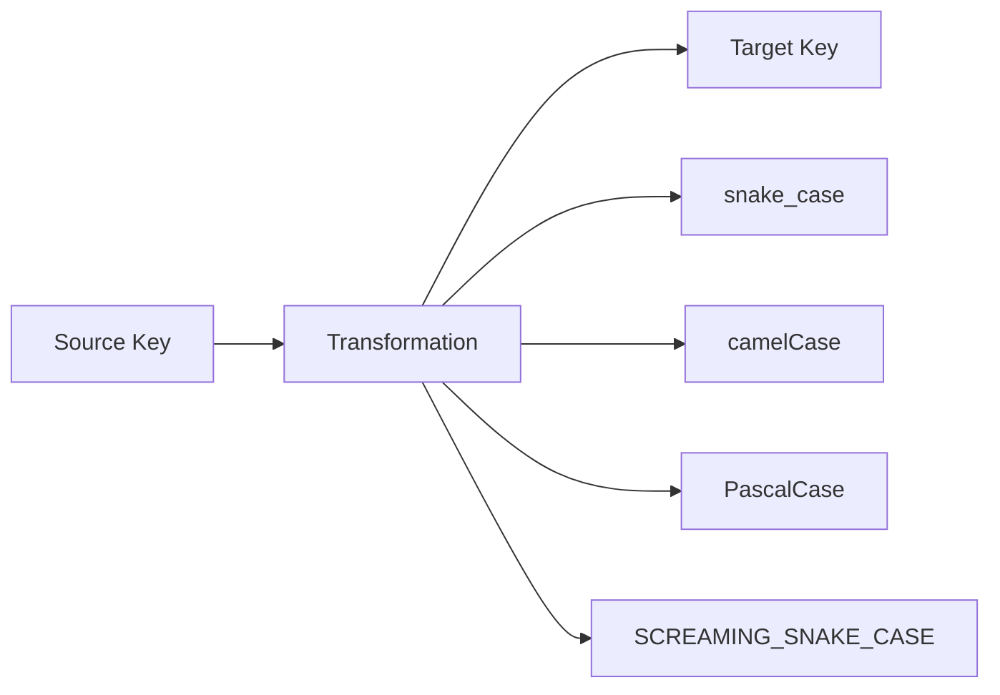

# Coding Strategies

This document details the various coding strategies implemented in MetaCodable and how to extend them.

## Core Strategies

### Key Transformation



Key transformations are handled through:
- `CodingKeys(_:)` attribute for global key style
- `CodedAt(_:)` for individual property key mapping
- Built-in support for various case styles

### Nested Coding

MetaCodable provides several strategies for handling nested data structures:

1. **Flattened Models**
```swift
@Codable
struct Coordinate {
    var latitude: Double
    var longitude: Double
    @CodedIn("additionalInfo")
    var elevation: Double
}
```

This automatically handles JSON like:
```json
{
    "latitude": 0,
    "longitude": 0,
    "additionalInfo": {
        "elevation": 0
    }
}
```

2. **Path-Based Access**
- Use `CodedAt(_:)` for direct path access
- Support for multiple path components
- Automatic container management

### Helper Coders

The `HelperCoder` protocol is the foundation for custom coding strategies:

```swift
protocol HelperCoder {
    associatedtype Coded
    func decode(from decoder: Decoder) throws -> Coded
    func encode(_ value: Coded, to encoder: Encoder) throws
}
```

Built-in helper coders include:
1. **ValueCoder**: Direct value coding
2. **SequenceCoder**: Collection handling
3. **DateCoder**: Date format handling
4. **Base64Coder**: Binary data encoding

## Extending the System

### Creating Custom Coders

1. Implement the `HelperCoder` protocol
2. Handle encoding and decoding logic
3. Use with `@CodedBy` attribute

Example:
```swift
struct CustomDateCoder: HelperCoder {
    let formatter: DateFormatter

    func decode(from decoder: Decoder) throws -> Date {
        let string = try String(from: decoder)
        guard let date = formatter.date(from: string) else {
            throw DecodingError.dataCorruptedError(
                in: decoder as! any SingleValueDecodingContainer,
                debugDescription: "Invalid date format"
            )
        }
        return date
    }

    func encode(_ value: Date, to encoder: Encoder) throws {
        try formatter.string(from: value).encode(to: encoder)
    }
}
```

### Protocol Generation

The MetaProtocolCodable build tool plugin supports:

1. **Dynamic Protocol Implementation**
   - Automatic conformance generation
   - Type-safe protocol handling
   - Cross-module support

2. **Build Process Integration**
   - Source code scanning
   - Implementation generation
   - Build-time validation

## Best Practices

1. **Key Naming**
   - Use consistent naming conventions
   - Leverage built-in transformations
   - Document custom key mappings

2. **Error Handling**
   - Provide meaningful default values
   - Use appropriate error strategies
   - Handle missing values gracefully

3. **Performance**
   - Use appropriate container types
   - Minimize nesting depth
   - Leverage built-in optimizations
