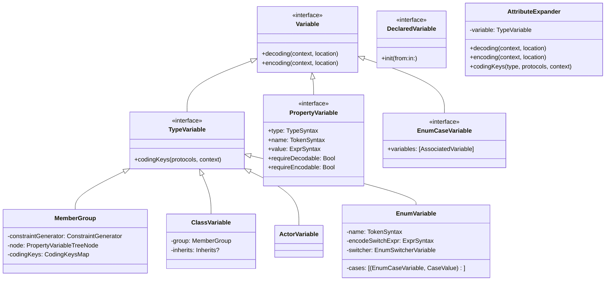
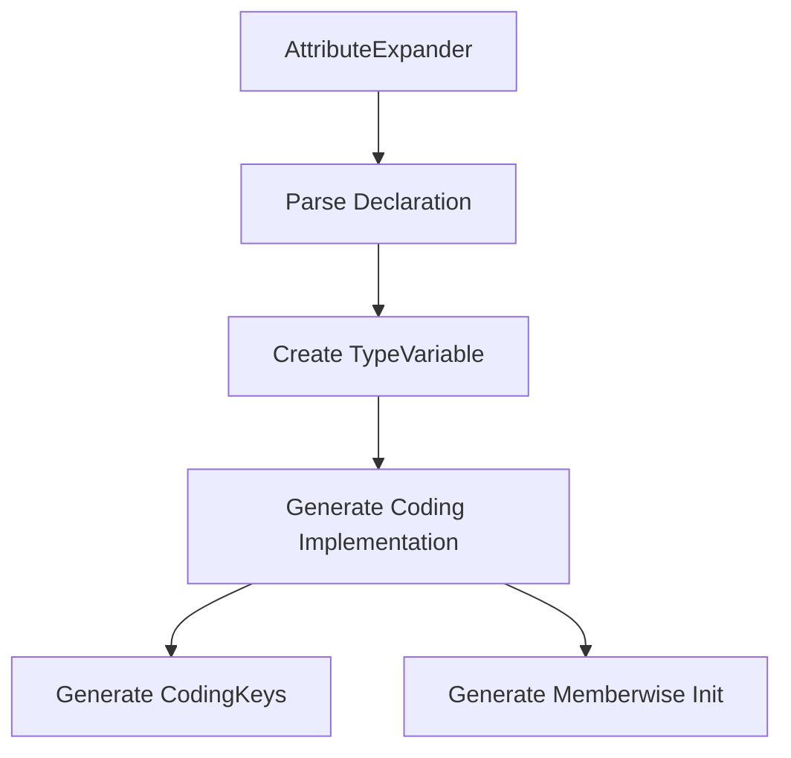
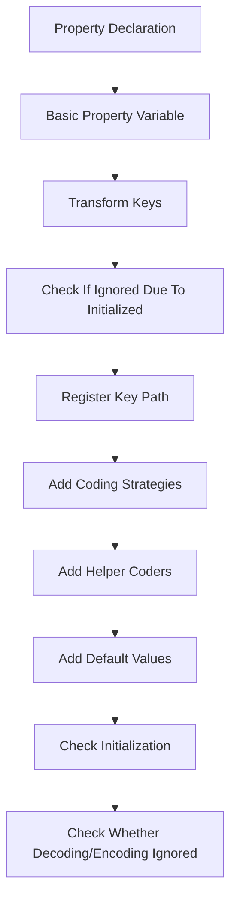
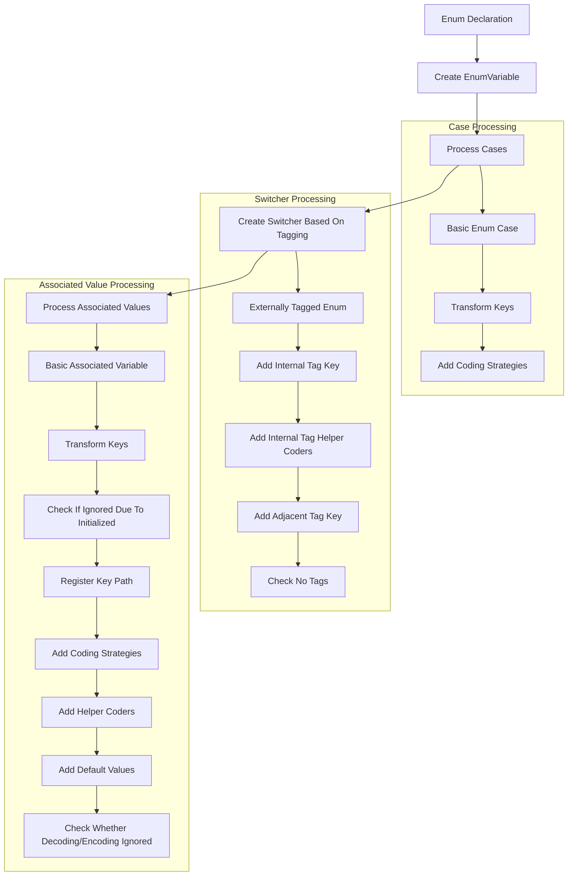
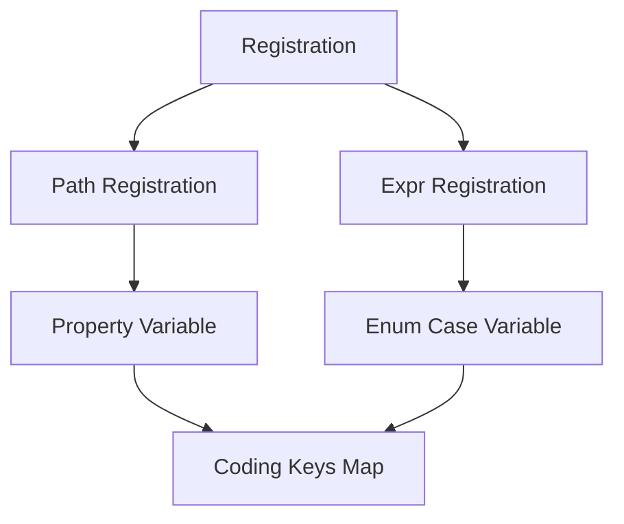

# Macro Processing Pipeline

This document details how the PluginCore module processes code through its macro system, from top-level types to their properties and enum cases.

## Class Hierarchy



## Processing Pipeline

### 1. Entry Point - Plugin and AttributeExpander

The macro processing starts with the `MetaCodablePlugin` ([`MacroPlugin/Plugin.swift`](../Sources/MacroPlugin/Plugin.swift)):

```swift
@main
struct MetaCodablePlugin: CompilerPlugin {
    let providingMacros: [Macro.Type] = [
        CodedAt.self,
        CodedIn.self,
        CodedBy.self,
        Default.self,
        // ... other macros
    ]
}
```

The `AttributeExpander` ([`PluginCore/Expansion/AttributeExpander.swift`](../Sources/PluginCore/Expansion/AttributeExpander.swift)) then processes declarations:



Key responsibilities:
- Creates appropriate `TypeVariable` instances based on declaration type
- Manages variable and `CodingKey` data registration
- Coordinates code generation for Codable conformance

The expander implementation starts in the constructor:

```swift
init?(
    for declaration: some DeclGroupSyntax,
    in context: some MacroExpansionContext
) {
    guard
        let decl = declaration as? any VariableSyntax,
        case let variable = decl.codableVariable(
            in: context
        ) as any DeclaredVariable,
        let typeVar = variable as? any TypeVariable
    else { return nil }
    self.variable = typeVar
    self.options = .init(for: declaration)
}

### 2. Type Variable Creation

Different types are handled by specialized implementations:

1. **MemberGroup** (for structs, as base implementation for classes and actors)
```swift
struct MemberGroup<Decl>: TypeVariable {
    let constraintGenerator: ConstraintGenerator
    let node: PropertyVariableTreeNode
    let codingKeys: CodingKeysMap
}
```

2. **ClassVariable** (for classes)
```swift
struct ClassVariable: TypeVariable {
    let group: MemberGroup<ClassDeclSyntax>
    let decl: ClassDeclSyntax
    var inherits: Inherits?
}
```

3. **EnumVariable** (for enums)
```swift
struct EnumVariable: TypeVariable {
    let name: TokenSyntax
    let encodeSwitchExpr: ExprSyntax
    let cases: [(variable: EnumCaseVariable, value: CaseValue)]
    let switcher: EnumSwitcherVariable
}
```

2. **ActorVariable** (for actors)
```swift
struct ActorVariable: TypeVariable {
    let base: MemberGroup<ActorDeclSyntax>
}
```

### 3. Property Processing

Properties are processed through specialized variable types that handle different aspects of coding. The main components are defined in [`PluginCore/Variables/Property`](../Sources/PluginCore/Variables/Property/):

#### Basic Property Variable
[`BasicPropertyVariable.swift`](../Sources/PluginCore/Variables/Property/BasicPropertyVariable.swift) handles standard property decoding/encoding:

```swift
struct BasicPropertyVariable: PropertyVariable {
    let name: TokenSyntax
    let type: TypeSyntax
    let value: ExprSyntax?
    let decodePrefix: TokenSyntax
    let encodePrefix: TokenSyntax

    func decoding(
        in context: some MacroExpansionContext,
        from location: PropertyCodingLocation
    ) -> CodeBlockItemListSyntax {
        switch location {
        case .coder(let decoder, let passedMethod):
            // Direct decoder implementation
        case .container(let container, let key, let passedMethod):
            // Container-based decoding
        }
    }

    func encoding(
        in context: some MacroExpansionContext,
        to location: PropertyCodingLocation
    ) -> CodeBlockItemListSyntax {
        // Similar pattern for encoding
    }
}
```

#### Helper Coded Variable
[`HelperCodedVariable.swift`](../Sources/PluginCore/Variables/Property/HelperCodedVariable.swift) manages custom coding helpers:

```swift
struct HelperCodedVariable<Wrapped>: ComposedVariable, PropertyVariable
where Wrapped: DefaultPropertyVariable {
    enum Options {
        case helper(_ expr: ExprSyntax)
        case helperAction(_ action: ExprSyntax, _ params: [Parameter])
    }

    func decoding(
        in context: some MacroExpansionContext,
        from location: PropertyCodingLocation
    ) -> CodeBlockItemListSyntax {
        // Generate helper-based decoding implementation
    }
}
```

#### Aliased Property Variable
[`AliasedPropertyVariable.swift`](../Sources/PluginCore/Variables/Property/AliasedPropertyVariable.swift) handles properties with multiple coding keys:

```swift
struct AliasedPropertyVariable<Wrapped>: PropertyVariable, ComposedVariable {
    let additionalKeys: OrderedSet<CodingKeysMap.Key>

    func decoding(
        in context: some MacroExpansionContext,
        from location: PropertyCodingLocation
    ) -> CodeBlockItemListSyntax {
        // Check multiple keys and decode from available one
    }
}
```

[The processing pipeline follows](../Sources/PluginCore/Variables/Type/MemberGroup.swift#L191) this flow:



<a name="property_variable"></a>

Core Protocol:
```swift
protocol PropertyVariable: NamedVariable {
    var type: TypeSyntax { get }
    var name: TokenSyntax { get }
    var value: ExprSyntax? { get }
    var requireDecodable: Bool? { get }
    var requireEncodable: Bool? { get }

    func decoding(in: MacroExpansionContext, from: PropertyCodingLocation) -> CodeBlockItemListSyntax
    func encoding(in: MacroExpansionContext, to: PropertyCodingLocation) -> CodeBlockItemListSyntax
}
```

### 4. Enum Case Processing

The [`PluginCore/Variables/Type/EnumVariable.swift`](../Sources/PluginCore/Variables/Type/EnumVariable.swift) module handles enum processing:

```swift
struct EnumVariable: TypeVariable {
    let name: TokenSyntax
    let encodeSwitchExpr: ExprSyntax
    let cases: [(variable: EnumCaseVariable, value: CaseValue)]
    let switcher: EnumSwitcherVariable

    func decoding(
        in context: some MacroExpansionContext,
        from location: TypeCodingLocation
    ) -> TypeGenerated? {
        // Generate enum decoding implementation
    }

    func encoding(
        in context: some MacroExpansionContext,
        to location: TypeCodingLocation
    ) -> TypeGenerated? {
        // Generate enum encoding implementation
    }
}
```

[The processing follows](../Sources/PluginCore/Variables/Type/EnumVariable.swift#L133) this flow:



Key Components:

1. **EnumSwitcherVariable**: Manages case detection and switching logic
```swift
protocol EnumSwitcherVariable: Variable {
    func node(for: EnumCaseVariableDeclSyntax, in: MacroExpansionContext)
    func codingKeys(in: MacroExpansionContext)
}
```

2. **EnumCaseVariable**: Handles individual case processing
```swift
protocol EnumCaseVariable: Variable {
    var variables: [AssociatedVariable] { get }
    var name: TokenSyntax { get }

    func decoding(in: MacroExpansionContext, from: EnumCaseCodingLocation) -> CodeBlockItemListSyntax
    func encoding(in: MacroExpansionContext, to: EnumCaseCodingLocation) -> CodeBlockItemListSyntax
}
```

3. **AssociatedVariable**: A [`PropertyVariable`](#property_variable) that handles associated value processing
```swift
protocol AssociatedVariable: PropertyVariable {
    var label: TokenSyntax? { get }
}
```

### 5. Code Generation

The code generation process is coordinated by the `AttributeExpander` ([`PluginCore/Expansion/AttributeExpander.swift`](../Sources/PluginCore/Expansion/AttributeExpander.swift)):

```swift
struct AttributeExpander {
    let variable: any TypeVariable
    private let options: Options

    func codableExpansion(
        for type: some TypeSyntaxProtocol,
        to protocols: [TypeSyntax],
        in context: some MacroExpansionContext
    ) -> [ExtensionDeclSyntax] {
        // Generate extensions for Codable conformance
    }
}
```

The generation process follows these steps:

1. **Decoding Generation** - Creates `init(from:)` implementation:
```swift
func decoding(in context: MacroExpansionContext, from location: TypeCodingLocation) -> TypeGenerated? {
    let container = location.context.forVariable

    // 1. Generate container access
    let containerDecl = generateContainerDeclaration(container)

    // 2. Generate property decoding
    for variable in variables where variable.decode ?? true {
        let decodingSyntax = variable.decoding(in: context, from: container)
    }

    // 3. Add initialization code
    let initCode = generateInitialization()

    // 4. Add error handling
    return TypeGenerated(
        code: containerDecl + decodingSyntax + initCode,
        modifiers: modifiers,
        whereClause: whereClause
    )
}
```

2. **Encoding Generation** - Creates `encode(to:)` implementation:
```swift
func encoding(in context: MacroExpansionContext, to location: TypeCodingLocation) -> TypeGenerated? {
    // 1. Create container
    let container = createEncodingContainer(location)

    // 2. Generate property encoding
    for variable in variables where variable.encode ?? true {
        let encodingSyntax = variable.encoding(in: context, to: container)
    }

    // 3. Add inheritance handling for classes
    if let superClass = inheritedType {
        let superEncoding = generateSuperEncoding(superClass)
    }

    // 4. Add error handling
    return TypeGenerated(
        code: containerCode + encodingSyntax + superEncoding,
        modifiers: modifiers,
        whereClause: whereClause
    )
}
```

3. **CodingKeys Generation** - Creates custom key enum:
```swift
func codingKeys(confirmingTo protocols: [TypeSyntax], in context: MacroExpansionContext) -> MemberBlockItemListSyntax {
    // 1. Check protocol conformance
    let decodable = variable.protocol(named: "Decodable", in: protocols)
    let encodable = variable.protocol(named: "Encodable", in: protocols)

    // 2. Generate coding keys enum
    let enumDecl = generateCodingKeysEnum()

    // 3. Add custom key mappings
    for (property, customKey) in keyMappings {
        let caseDecl = generateKeyCase(property, customKey)
    }

    return MemberBlockItemListSyntax([enumDecl, casesDecl])
}
```

## Variable Registration System

The registration system manages the relationship between variables and their coding keys:



### Registration Types

The registration system is implemented in [`PluginCore/Variables/Type/Data/Registration.swift`](../Sources/PluginCore/Variables/Type/Data/Registration.swift) and defines two main registration types:

1. [**PathRegistration**](../Sources/PluginCore/Variables/Type/Data/Registration.swift#L83): For properties with coding key paths
```swift
/// A type representing property variable registration for code generation.
typealias PathRegistration<Decl, Var> = Registration<Decl, [String], Var>
where Var: Variable
```

2. [**ExprRegistration**](../Sources/PluginCore/Variables/Type/Data/Registration.swift#L88): For enum cases with expressions
```swift
typealias ExprRegistration<Decl, Var> = Registration<Decl, [ExprSyntax], Var>
```

## Helper Components

1. **PropertyVariableTreeNode** ([`PluginCore/Variables/Property/Tree/PropertyVariableTreeNode.swift`](../Sources/PluginCore/Variables/Property/Tree/PropertyVariableTreeNode.swift#L1-L29))
   - Implements a Trie-based tree structure for managing nested coding paths
   - Core implementation:
   ```swift
   final class PropertyVariableTreeNode: Variable, VariableTreeNode {
       var variables: [any PropertyVariable] = []
       var children: OrderedDictionary<CodingKeysMap.Key, PropertyVariableTreeNode> = [:]
       private var decodingContainer: TokenSyntax?
       var immutableEncodeContainer: Bool = false
   }
   ```

   - **Key Features**:
     - **Tree-based Registration** ([L60-88](../Sources/PluginCore/Variables/Property/Tree/PropertyVariableTreeNode+CodingData.swift#L60-L88))
     ```swift
     mutating func register<Variable: PropertyVariable>(
         variable: Variable,
         keyPath: [CodingKeysMap.Key],
         immutableEncodeContainer: Bool = false
     )
     ```
     - **Decoding Generation** ([L29-56](../Sources/PluginCore/Variables/Property/Tree/PropertyVariableTreeNode.swift#L29-L56))
     - **Encoding Generation** ([L153-180](../Sources/PluginCore/Variables/Property/Tree/PropertyVariableTreeNode.swift#L153-L180))

2. **CodingKeysMap** ([`PluginCore/Variables/Type/Data/CodingKeysMap/CodingKeysMap.swift`](../Sources/PluginCore/Variables/Type/Data/CodingKeysMap/CodingKeysMap.swift#L1-L32))
   - Manages key name generation and uniqueness
   - Main implementation:
   ```swift
   final class CodingKeysMap {
       let typeName: TokenSyntax
       let fallbackTypeName: TokenSyntax?
       private var data: OrderedDictionary<String, Case> = [:]
       private var usedKeys: Set<String> = []

       var type: ExprSyntax {
           guard data.isEmpty, usedKeys.isEmpty, let fallbackTypeName
           else { return "\(typeName).self" }
           return "\(fallbackTypeName).self"
       }
   }
   ```

   - **Key Features**:
     - **Key Registration** ([L96-122](../Sources/PluginCore/Variables/Type/Data/CodingKeysMap/CodingKeysMap.swift#L96-L122))
     - **Case Generation** ([L121-147](../Sources/PluginCore/Variables/Type/Data/CodingKeysMap/CodingKeysMap.swift#L121-L147))
     - **Key Transformation** ([L77-96](../Sources/PluginCore/Variables/Type/Data/CodingKeysMap/CodingKeysMap.swift#L77-L96))

3. **ConstraintGenerator** ([`PluginCore/Variables/Type/Data/ConstraintGenerator.swift`](../Sources/PluginCore/Variables/Type/Data/ConstraintGenerator.swift#L1-L35))
   - Manages generic constraints for Codable conformance
   - Core implementation:
   ```swift
   struct ConstraintGenerator {
       var typeArguments: [TokenSyntax] = []

       func codingClause(
           forRequirementPath path: KeyPath<any PropertyVariable, Bool?>,
           withVariables variables: [any PropertyVariable],
           conformingTo protocol: TypeSyntax
       ) -> GenericWhereClauseSyntax?
   }
   ```

   - **Key Features**:
     - **Generic Parameter Handling** ([L35-59](../Sources/PluginCore/Variables/Type/Data/ConstraintGenerator.swift#L35-L59))
     - **Protocol Requirements** ([L59-89](../Sources/PluginCore/Variables/Type/Data/ConstraintGenerator.swift#L59-L89))

## Best Practices

1. **Variable Processing**
   - Always validate variable declarations
   - Handle optional and required cases
   - Process nested containers properly

2. **Code Generation**
   - Generate optimal, non-redundant code
   - Handle inheritance correctly
   - Maintain proper error handling

3. **Type Safety**
   - Validate type constraints
   - Check protocol conformance
   - Handle generic parameters
