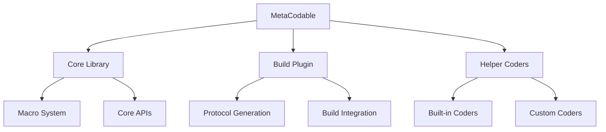

# Contributing Documentation

This directory contains detailed documentation about MetaCodable's implementation and development practices.

## Table of Contents

1. [Architecture Overview](ARCHITECTURE.md)
   - Core components and system design
   - Data flow and processing
   - Key architectural decisions

2. [Macro Processing Pipeline](MACRO_PROCESSING.md)
   - Detailed class hierarchy
   - Processing steps
   - Code generation system

3. [Coding Strategies](CODING_STRATEGIES.md)
   - Implementation of coding strategies
   - Helper coders system
   - Custom coding patterns

4. [Build Plugin System](BUILD_PLUGIN.md)
   - Plugin architecture
   - Build process integration
   - Code generation system

5. [Testing and Development](TESTING.md)
   - Testing methodology
   - Development workflow
   - Best practices

## Project Structure



## Quick Start for Contributors

1. **Setup Development Environment**
   ```bash
   git clone https://github.com/SwiftyLab/MetaCodable.git
   cd MetaCodable
   swift build
   ```

2. **Run Tests**
   ```bash
   swift test
   ```

3. **Documentation Generation**
   ```bash
   swift package generate-documentation
   ```

## Development Guidelines

### Code Style

- Follow [Swift API Design Guidelines](https://www.swift.org/documentation/api-design-guidelines/)
- Use swift-format for code formatting
- Write comprehensive documentation

### Pull Request Process

1. Fork the repository
2. Create a feature branch
3. Add tests and documentation
4. Submit a pull request

### Version Control Practices

- Use semantic versioning
- Keep commits focused and atomic
- Write clear commit messages

## Module Structure

The project is organized into several key modules:

1. **MetaCodable Core**
   - Main macro implementations
   - Core coding functionality
   - API definitions

2. **Helper Coders**
   - Built-in coding helpers
   - Extension points
   - Utility functions

3. **Build Plugin**
   - Protocol generation
   - Build system integration
   - Code synthesis

4. **Testing Infrastructure**
   - Test helpers
   - Macro testing utilities
   - Integration tests

## Documentation Standards

1. **API Documentation**
   - Document all public APIs
   - Include usage examples
   - Explain edge cases

2. **Implementation Notes**
   - Document complex algorithms
   - Explain design decisions
   - Note performance considerations

3. **Test Documentation**
   - Describe test scenarios
   - Document test data
   - Explain test coverage

## Getting Help

- Join our community discussions
- Review existing issues
- Check documentation first

## License and Attribution

MetaCodable is licensed under the MIT License. See the [LICENSE](../LICENSE) file for details.

## Additional Resources

- [Swift Macros Documentation](https://docs.swift.org/swift-book/documentation/the-swift-programming-language/macros)
- [Swift Package Manager Documentation](https://www.swift.org/package-manager/)
- [Codable Documentation](https://developer.apple.com/documentation/swift/codable)
