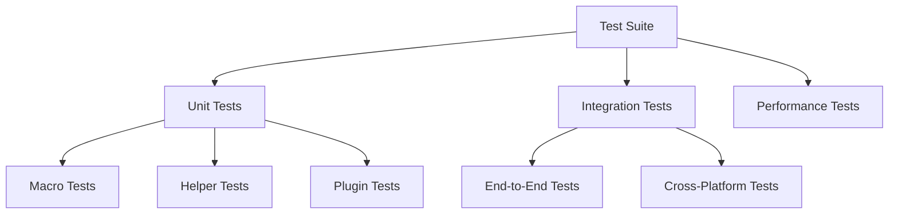

# Testing and Development Guide

This document outlines the testing methodology and development practices for MetaCodable.

## Testing Architecture



## Test Categories

### 1. Macro Tests

Located in `Tests/MetaCodableTests`, these tests verify:
- Macro expansion correctness
- Error diagnostics
- Edge cases handling

Example test structure:
```swift
struct CodingKeysTests {
    @Test
    func testBasicExpansion() {
        assertMacroExpansion(
            """
            @Codable
            struct Model {
                let property: String
            }
            """,
            expandedSource: // Expected expansion
        )
    }
}
```

### 2. Helper Coder Tests

Tests for built-in and custom helper coders:
- Encoding/decoding accuracy
- Error handling
- Performance characteristics

### 3. Plugin Tests

Tests for the build tool plugin:
- Configuration handling
- Code generation
- Build process integration

## Development Workflow

### 1. Local Development

Setup:
1. Clone repository
2. Install dependencies
3. Build project:
   ```bash
   swift build
   ```

### 2. Testing Process

Run tests:
```bash
swift test
```

Coverage:
```bash
swift test --enable-code-coverage
```

### 3. CI/CD Pipeline

The project uses GitHub Actions for:
- Automated testing
- Cross-platform validation
- Documentation generation

## Best Practices

### 1. Code Style

- Follow Swift API Design Guidelines
- Use SwiftFormat for formatting
- Maintain consistent documentation

### 2. Testing Guidelines

1. **Test Organization**
   - Group related tests
   - Clear test names
   - Comprehensive coverage

2. **Test Data**
   - Use realistic examples
   - Cover edge cases
   - Document test cases

3. **Performance Testing**
   - Benchmark critical paths
   - Profile memory usage
   - Test with large datasets

### 3. Documentation

- Document public APIs
- Provide usage examples
- Update docs with changes

## Debugging

### 1. Macro Debugging

Tools and techniques:
- Print expanded source
- Analyze diagnostics
- Use breakpoints

Example debugging session:
```swift
#if DEBUG
print(expandedSource)
#endif
```

### 2. Plugin Debugging

Debug build plugin:
1. Enable verbose output
2. Check intermediate files
3. Analyze build logs

### 3. Runtime Debugging

Debug coding issues:
1. Enable detailed logging
2. Use debugging proxies
3. Validate data structures

## Performance Considerations

### 1. Compile Time

Optimize for:
- Macro expansion speed
- Plugin execution time
- Build system integration

### 2. Runtime

Monitor:
- Encoding/decoding performance
- Memory usage
- Error handling overhead

### 3. Benchmarking

Use benchmarks to:
- Track performance
- Identify bottlenecks
- Validate optimizations

## Contributing Guidelines

### 1. Pull Requests

Process:
1. Create feature branch
2. Add tests
3. Update documentation
4. Submit PR

### 2. Code Review

Checklist:
- Test coverage
- Performance impact
- API compatibility
- Documentation updates
