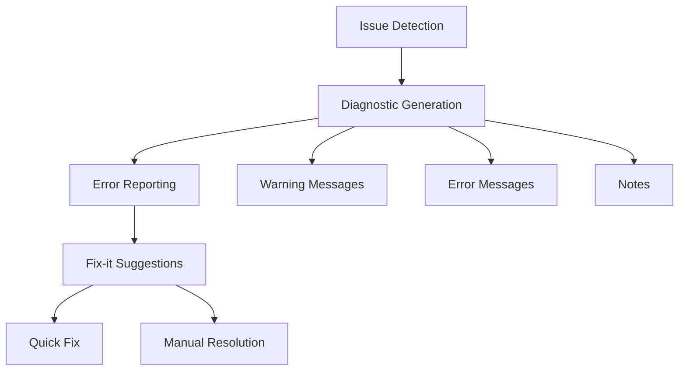

# Troubleshooting Guide

This document provides solutions for common issues encountered while working with MetaCodable.

## Diagnostic System



## Common Issues

### 1. Macro Expansion Issues

#### Symptoms
- Macro expansion fails
- Unexpected generated code
- Compilation errors in generated code

#### Troubleshooting Steps
1. Check macro syntax
2. Verify attribute parameters
3. Review error messages
4. Check for conflicting attributes

#### Example Resolution
```swift
// Instead of:
@Codable
@CodingKeys(.snake_case)
@CodingKeys(.PascalCase)  // Error: Multiple CodingKeys attributes
struct Model { }

// Use:
@Codable
@CodingKeys(.snake_case)
struct Model { }
```

### 2. Build Plugin Problems

#### Symptoms
- Plugin fails to run
- Missing generated code
- Build errors

#### Troubleshooting Steps
1. Check plugin configuration
2. Verify source file paths
3. Review build logs
4. Check intermediate files

### 3. Helper Coder Issues

#### Symptoms
- Encoding/decoding failures
- Unexpected data transformations
- Runtime errors

#### Troubleshooting Steps
1. Verify coder implementation
2. Check input/output data
3. Review error handling
4. Test edge cases

## Error Messages

### 1. Macro Diagnostics

Common error messages and their solutions:

| Error Message | Cause | Solution |
|--------------|-------|----------|
| "Cannot find type..." | Missing type in scope | Import required module |
| "Invalid attribute arguments" | Wrong attribute parameters | Check parameter types |
| "Conflicting attributes" | Multiple incompatible attributes | Remove conflicting attribute |

### 2. Build Errors

Common build errors and their solutions:

| Error | Cause | Solution |
|-------|-------|----------|
| Plugin execution failed | Build tool issue | Check plugin configuration |
| Missing generated files | Source scanning issue | Verify source paths |
| Symbol not found | Link error | Check module imports |

## Debugging Techniques

### 1. Macro Debugging

```swift
// Add debug prints in development:
#if DEBUG
print("Generated code: \(expandedSource)")
#endif
```

### 2. Build Plugin Debugging

Enable verbose output:
```bash
swift build -v
```

### 3. Runtime Debugging

Add logging:
```swift
struct DebugCoder<T: Codable>: HelperCoder {
    func decode(from decoder: Decoder) throws -> T {
        print("Decoding type: \(T.self)")
        return try T(from: decoder)
    }
}
```

## Performance Issues

### 1. Compile Time

#### Symptoms
- Slow compilation
- High memory usage
- Build timeouts

#### Solutions
1. Optimize macro implementations
2. Reduce generated code size
3. Use incremental builds

### 2. Runtime

#### Symptoms
- Slow encoding/decoding
- High memory usage
- Poor app performance

#### Solutions
1. Profile code
2. Optimize algorithms
3. Cache results

## Best Practices

### 1. Error Prevention

- Use type-safe APIs
- Add comprehensive tests
- Document edge cases
- Follow coding guidelines

### 2. Debugging

- Enable verbose logging
- Use breakpoints
- Check intermediate states
- Review generated code

### 3. Performance

- Profile critical paths
- Benchmark operations
- Monitor resource usage
- Optimize hot spots

## Getting Help

### 1. Resources

- Project documentation
- API reference
- Sample code
- Test cases

### 2. Community

- GitHub issues
- Discussion forums
- Stack Overflow
- Community channels

## Reporting Issues

When reporting issues:

1. **Provide Context**
   - Swift version
   - MetaCodable version
   - Operating system
   - Build environment

2. **Include Details**
   - Error messages
   - Stack traces
   - Sample code
   - Expected vs actual behavior

3. **Steps to Reproduce**
   - Clear steps
   - Minimal example
   - Required setup
   - Environment details
